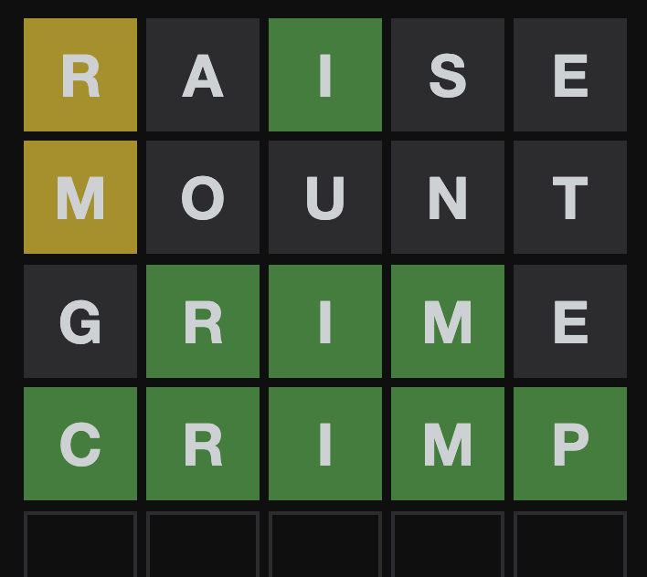

# Wordle game
This is a wordle inspired game for the course DD1349

### About the game
This is a project inspired by the famous game “wordle”. Wordle is a word guessing game where the player is supposed to guess a five letter word with six guesses. After the player has guessed a legitimate word, the letters will change color depending on the circumstance. If a letter turns gray, it is not in the word. If the letter turns yellow, it is in the word but it is currently at the wrong spot. If the letter turns green, it is located in the correct spot. 

